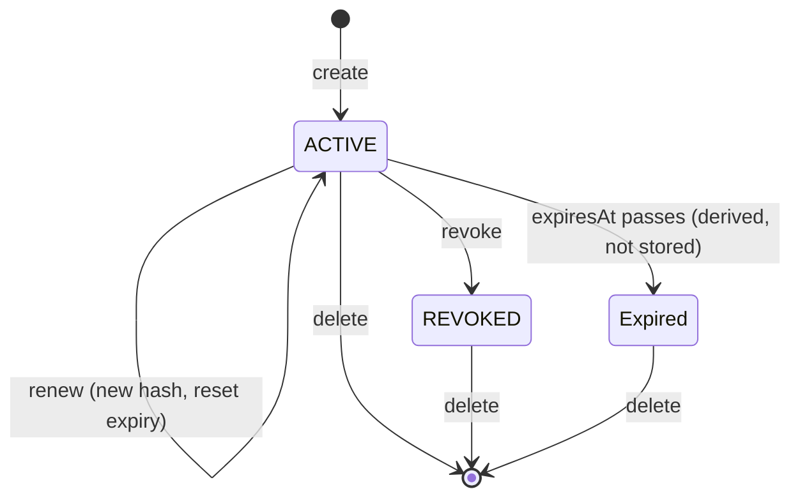
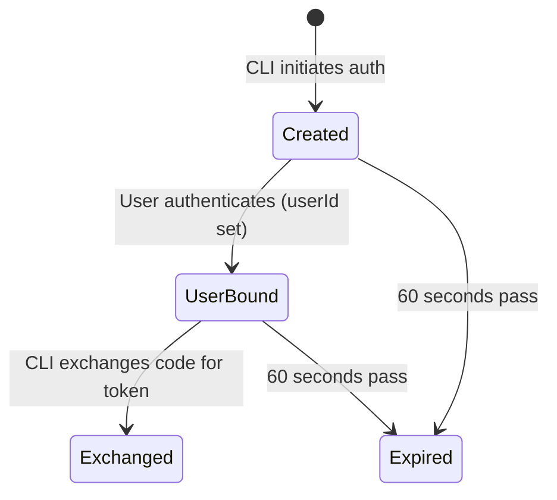

# Data Model: OpenAPI Specification & Personal Access Tokens

**Date**: 2026-04-09 | **Spec**: [spec.md](./spec.md)

## New Entities

### PersonalAccessToken

Stores hashed tokens for programmatic API access.

| Field | Type | Constraints | Notes |
|-------|------|-------------|-------|
| id | String | PK, cuid() | |
| name | String | Required | User-provided label, unique per user |
| tokenHash | String | Required, unique | SHA-256 hash of the full token value |
| tokenPrefix | String | Required | First 8 chars after prefix separator, for UI display (e.g., `a1b2c3d4`) |
| userId | String | FK → User.id | Token owner |
| type | TokenType | Required | `PAT` or `CLI_LOGIN` |
| expiresAt | DateTime | Required | PAT default: 90d, CLI login default: 30d |
| lastUsedAt | DateTime? | Nullable | Updated asynchronously on each use |
| status | TokenStatus | Default: ACTIVE | `ACTIVE`, `REVOKED` |
| revokedAt | DateTime? | Nullable | Set when status changes to REVOKED |
| renewalCount | Int | Default: 0 | Incremented on each renewal |
| createdAt | DateTime | Default: now() | |
| updatedAt | DateTime | @updatedAt | |

**Indexes**:
- `@@unique([userId, name])` — token names unique per user
- `@@index([tokenHash])` — fast lookup during auth
- `@@index([userId, status])` — fast listing for user's token page
- `@@index([status, expiresAt])` — for finding expired tokens

**Relations**:
- `user: User @relation(fields: [userId], references: [id], onDelete: Cascade)` — deleting a user cascades to their tokens

### CliAuthCode

Temporary authorization codes for the CLI browser login flow. Short-lived (60 seconds).

| Field | Type | Constraints | Notes |
|-------|------|-------------|-------|
| id | String | PK, cuid() | |
| code | String | Required, unique | Random authorization code |
| state | String | Required | CSRF protection state parameter from CLI |
| callbackUrl | String | Required | CLI's localhost callback URL |
| userId | String? | FK → User.id, nullable | Set after user authenticates |
| exchanged | Boolean | Default: false | Set to true when code is exchanged for token |
| expiresAt | DateTime | Required | 60 seconds after creation |
| createdAt | DateTime | Default: now() | |

**Indexes**:
- `@@index([code])` — fast lookup during token exchange
- `@@index([expiresAt])` — for cleanup of expired codes

**Relations**:
- `user: User? @relation(fields: [userId], references: [id], onDelete: Cascade)`

## New Enums

### TokenType

```
enum TokenType {
  PAT
  CLI_LOGIN
}
```

### TokenStatus

```
enum TokenStatus {
  ACTIVE
  REVOKED
}
```

Note: "Expired" is not a stored status — it's derived at query time from `expiresAt < now()`. This avoids needing a background job to update statuses.

## Modified Entities

### User

Add reverse relation:
- `personalAccessTokens: PersonalAccessToken[]`
- `cliAuthCodes: CliAuthCode[]`

### AuditAction (enum)

Add new values:
- `PAT_CREATED`
- `PAT_REVOKED`
- `PAT_RENEWED`
- `PAT_DELETED`
- `CLI_LOGIN_COMPLETED`

## State Transitions

### PersonalAccessToken Lifecycle



### CliAuthCode Lifecycle



## Environment Variables

| Variable | Default | Description |
|----------|---------|-------------|
| `PAT_TOKEN_PREFIX` | `starter_pat` | Prefix for generated tokens |
| `PAT_DEFAULT_EXPIRY_DAYS` | `90` | Default PAT expiration in days |
| `CLI_TOKEN_DEFAULT_EXPIRY_DAYS` | `30` | Default CLI login token expiration |
| `PAT_MAX_ACTIVE_PER_USER` | `10` | Maximum active tokens per user |

## Data Volume Estimates

- ~10 users × 10 tokens max = ~100 token records
- CliAuthCode records are ephemeral (60s TTL), cleaned up periodically
- Audit entries: ~5-10 per day for token operations

