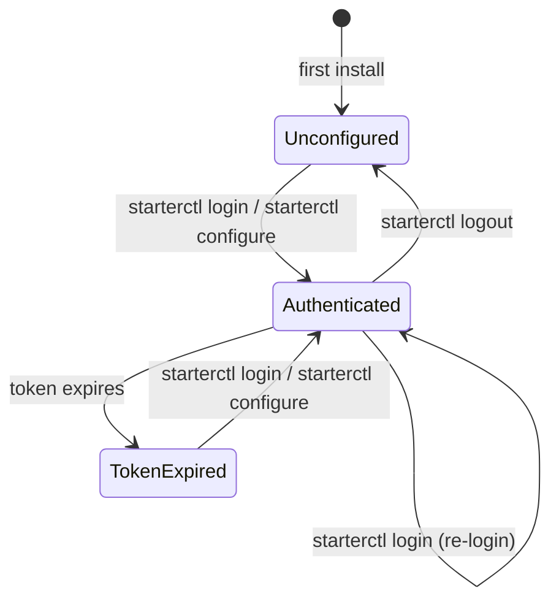

# Data Model: Cross-Platform CLI Client

**Date**: 2026-04-09 | **Spec**: [spec.md](./spec.md)

## Local Data Structures

The CLI is a client application — it does not have a database. All persistent state is in the config file.

### Config File

**Location**: `~/.config/starterctl/config.json` (Linux/macOS), `%APPDATA%\starterctl\config.json` (Windows)
**Permissions**: 0600 (owner read/write only)

```json
{
  "server_url": "https://my-app.example.com/app",
  "token": "starter_pat_a1b2c3d4e5f6..."
}
```

| Field      | Type   | Required | Notes                                      |
| ---------- | ------ | -------- | ------------------------------------------ |
| server_url | string | Yes      | Full URL including base path if applicable |
| token      | string | Yes      | PAT or CLI login token                     |

### Version Check Cache

**Location**: `~/.config/starterctl/version-check.json` (Linux/macOS), `%APPDATA%\starterctl\version-check.json` (Windows)

```json
{
  "latest_version": "1.2.3",
  "checked_at": "2026-04-09T10:00:00Z"
}
```

| Field          | Type   | Notes                                       |
| -------------- | ------ | ------------------------------------------- |
| latest_version | string | Semver of latest GitHub Release             |
| checked_at     | string | ISO 8601 timestamp, cache expires after 24h |

## API Response Types (Go structs)

These mirror the server API responses from spec 012's contracts.

### User

```go
type User struct {
    ID     string `json:"id"`
    Name   string `json:"name"`
    Email  string `json:"email"`
    Role   string `json:"role"`
    Status string `json:"status"`
}
```

### AuditEntry

```go
type AuditEntry struct {
    ID         string `json:"id"`
    Action     string `json:"action"`
    EntityType string `json:"entityType"`
    EntityId   string `json:"entityId"`
    ActorId    string `json:"actorId"`
    Details    string `json:"details"`
    CreatedAt  string `json:"createdAt"`
}
```

### BackgroundJob

```go
type BackgroundJob struct {
    ID        string `json:"id"`
    JobType   string `json:"jobType"`
    Status    string `json:"status"`
    CreatedAt string `json:"createdAt"`
}
```

### HealthResponse

```go
type HealthResponse struct {
    Status   string `json:"status"`
    Database string `json:"database"`
    Version  string `json:"version"`
}
```

### LoginResponse (from CLI auth token exchange)

```go
type LoginResponse struct {
    Token     string `json:"token"`
    ExpiresAt string `json:"expiresAt"`
    User      User   `json:"user"`
}
```

## State Transitions

### CLI Authentication State



## Environment Variables

| Variable                | Overrides         | Description |
| ----------------------- | ----------------- | ----------- |
| `STARTERCTL_SERVER_URL` | config.server_url | Server URL  |
| `STARTERCTL_TOKEN`      | config.token      | API token   |

Environment variables take precedence over the config file.

## Exit Codes

| Code | Meaning                                                |
| ---- | ------------------------------------------------------ |
| 0    | Success                                                |
| 1    | General error (API error, invalid input)               |
| 2    | Authentication error (no token, expired, unauthorized) |
| 3    | Connection error (server unreachable)                  |
| 4    | Permission error (role insufficient)                   |
