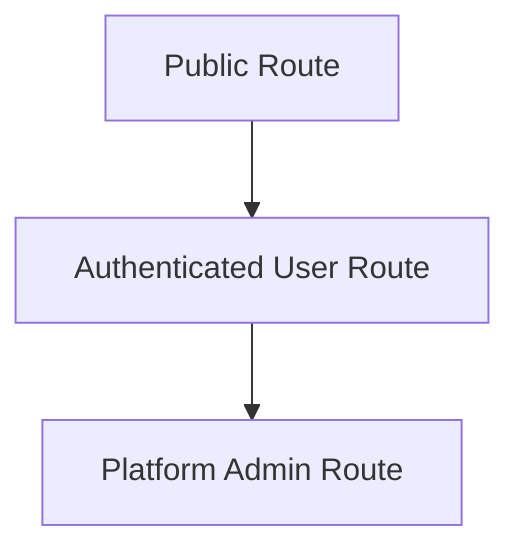

# API Surface

## Purpose

This document provides a stable high-level map of the backend routes exposed by the starter.

It is not intended to replace route-specific implementation details.

## Route Groups

### Auth Routes

- `/api/auth/login`
- `/api/auth/logout`
- `/api/auth/session`
- `/api/auth/change-password`
- `/api/auth/error`
- `/api/auth/callback/[provider]`
- `/api/auth/sso/azure`

Responsibilities:

- session lifecycle
- local login
- password-change enforcement
- SSO initiation and callback handling

### User Administration

- `/api/users`
- `/api/users/[id]/approve`
- `/api/users/[id]/deactivate`
- `/api/users/[id]/reactivate`
- `/api/users/[id]/role`
- `/api/users/[id]/theme`

Responsibilities:

- create local users
- manage user lifecycle
- update roles
- update theme preferences

### Audit

- `/api/audit`
- `/api/audit/export`

Responsibilities:

- query audit entries
- export audit data

### Background Jobs

- `/api/background-jobs`

Responsibilities:

- create jobs
- list jobs
- expose job state for admins and creators

### Operational / Utility

- `/api/health`
- `/api/locale`

Responsibilities:

- health reporting
- locale preference updates

## API Access Model

Typical expectations:

- auth entry points may be public
- most application routes require authentication
- admin operations require platform-admin authorization

## Response Style

- JSON responses for route handlers
- explicit error responses for invalid input or unauthorized access
- consistent use of server-side auth guards before sensitive operations

## Background Job API Contract

### POST `/api/background-jobs`

Creates a new job for the current user.

Expected input:

- `jobType`
- `payload`

Expected output:

- created job metadata

### GET `/api/background-jobs`

Lists recent jobs.

Behavior:

- platform admins can see all jobs
- non-admin users can only see their own jobs

## Health Endpoint Expectations

The health endpoint should remain safe for operational use and report enough information to detect:

- process availability
- application readiness
- database availability

## Design Constraints

- sensitive routes must not rely on client-side checks alone
- route structure should remain simple enough for extension by new product features
- starter routes should stay broadly reusable across derived repos
