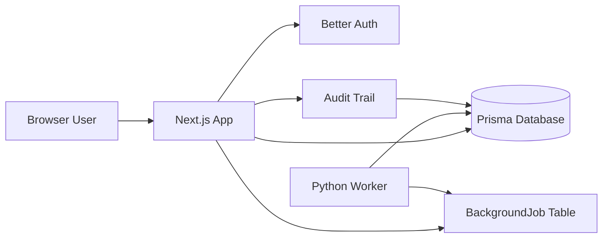
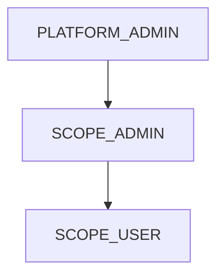
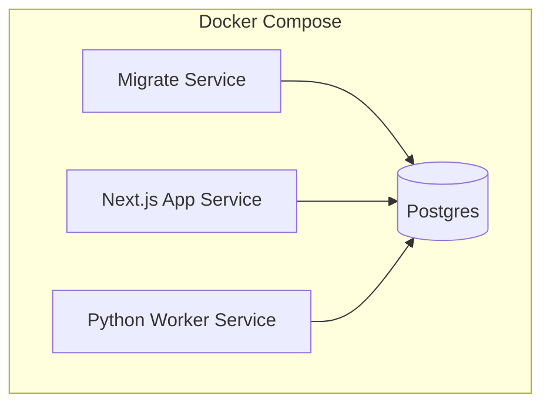

# Architecture

## Purpose

This starter provides a reusable internal business app foundation with:

- authenticated web UI
- role-based access control
- operational auditability
- background job processing
- local SQLite development and Docker/PostgreSQL deployment

## System Overview

## Major Components

### Web Application

- Framework: Next.js 16 with App Router
- UI: React-based dashboard, auth pages, admin pages, localized messages
- API: route handlers under `src/app/api`
- Responsibilities:
  - authentication entry points
  - dashboard rendering
  - admin workflows
  - background job creation
  - audit export and operational endpoints

### Authentication

- Primary library: Better Auth
- Supported auth modes:
  - local email/password
  - Azure / Microsoft Entra SSO
- Session-aware server guards:
  - `requireSession()`
  - `requireApiUser()`

### Data Layer

- ORM/client: Prisma
- Local mode:
  - SQLite
  - `prisma/schema.prisma`
- Docker / production-style mode:
  - PostgreSQL
  - `prisma/schema.postgres.prisma`
- Runtime DB adapter selection happens from `DATABASE_URL`

### Background Jobs

- Shared persistence model: `BackgroundJob`
- Producer:
  - Next.js API route creates jobs
- Consumer:
  - Python worker polls and claims jobs
- Current starter job types:
  - `noop`
  - `echo`

### Auditability And Observability

- audit entries stored in the app database
- structured JSON logging
- request IDs
- health endpoint
- continuity files for repo handoff state

## Role Model

- `PLATFORM_ADMIN`
  - full platform administration
  - user management
  - audit access
  - background jobs dashboard
- `SCOPE_ADMIN`
  - scoped administration
- `SCOPE_USER`
  - standard scoped usage

## Deployment Shape

- `migrate` applies Prisma Postgres migrations before app startup
- `app` and `migrate` reuse the same application image
- `worker` runs as a separate image and process

## Important Constraints

- local development should work without PostgreSQL
- production-style deployment should fail loudly if PostgreSQL is unavailable
- continuity files should reflect the current repo state
- dependency install policy should reject unsupported npm/uv environments
