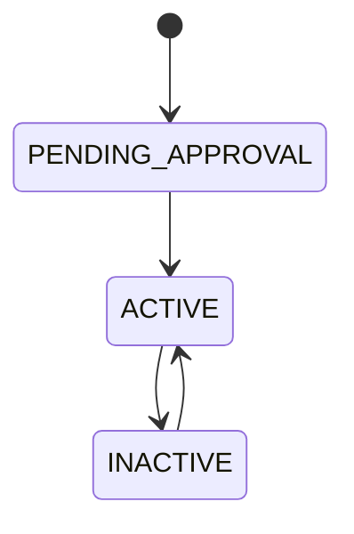
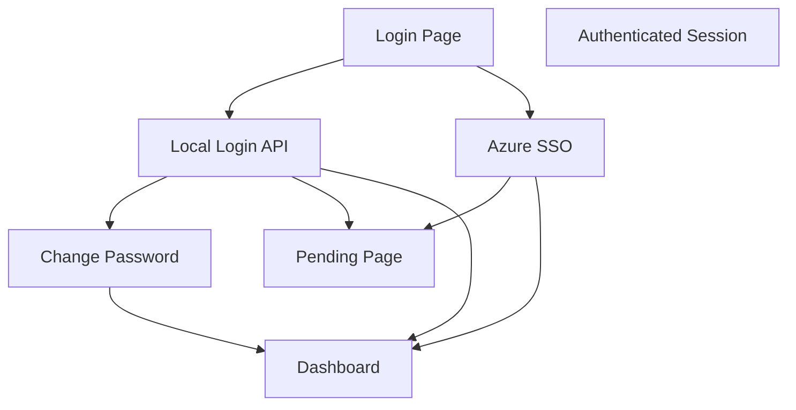

# Auth And RBAC

## Authentication Modes

The starter supports two primary authentication paths:

- local email/password
- Azure / Microsoft Entra SSO

The auth model is intentionally hybrid:

- some users are local-only
- some users are SSO-only
- some users may be linked across both modes

## Auth Components

- Better Auth for sessions and auth integration
- local login route under `src/app/api/auth/login/route.ts`
- logout and session routes under `src/app/api/auth`
- Azure SSO entry and callback routes under `src/app/api/auth/sso` and `src/app/api/auth/callback`

## Session Guards

### UI Access

- `requireSession()`
  - redirects unauthenticated users to login
  - redirects pending local users to the pending page

### API Access

- `requireApiUser()`
  - validates authenticated access for route handlers
  - returns an auth error response for unauthenticated calls

## Local Account Rules

- local users authenticate with email and password
- starter-seeded admin uses local login
- local users may be forced to change password on first login
- password changes are handled by the change-password route and page

## SSO Rules

- Azure SSO is supported through Microsoft Entra / Azure AD config
- the system can provision or link SSO users
- revoked or unapproved users should not gain app access

## User Status Rules

- `PENDING_APPROVAL`
  - user can exist in the system but does not get normal app access
- `ACTIVE`
  - normal app access is allowed
- `INACTIVE`
  - session use should be blocked

## Role Model

### PLATFORM_ADMIN

- full administrative access
- can manage users
- can access audit trail
- can access background jobs dashboard

### SCOPE_ADMIN

- intended for scoped administration
- not equivalent to platform admin

### SCOPE_USER

- standard scoped access
- lowest built-in privilege level

## RBAC Expectations

- admin-only pages must enforce role checks on the server
- admin-only API routes must enforce role checks in handlers
- navigation can hide links, but hidden links are not the authorization mechanism
- route and server guard checks remain the source of truth

## Baseline Auth Flows

## Important Constraints

- auth must work in both SQLite local mode and PostgreSQL deployment mode
- login pages should remain resilient to browser autofill and extension interference
- account status and role checks must be enforced server-side
