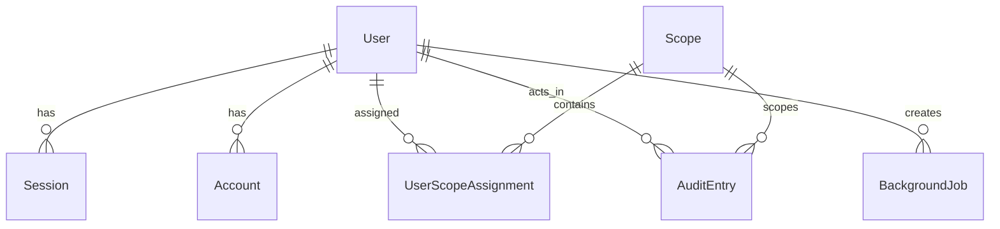

# Data Model

## Purpose

This document summarizes the core persistent model used by the starter.

The canonical source remains the Prisma schema, but this file explains the structure at a repo level.

## Main Entities

### User

Represents a person who can access the app.

Key concerns:

- identity
- role
- account status
- auth mode
- locale/theme preferences

Important fields:

- `email`
- `name`
- `role`
- `status`
- `authMethod`
- `passwordHash`
- `mustChangePassword`
- `themePreference`
- `locale`

### Session

Represents an authenticated user session.

Important fields:

- `token`
- `userId`
- `expiresAt`

### Account

Represents an auth-provider-linked account.

Used for:

- local credential login
- external provider linkage

### Verification

Stores verification and token-style records required by auth workflows.

### Scope

Represents a domain or access scope within the product.

### UserScopeAssignment

Links users to scopes.

### AuditEntry

Stores security and administrative audit records.

Important dimensions:

- action
- actor
- entity type / entity id
- optional scope
- details payload
- timestamp

### BackgroundJob

Represents asynchronous work created by the app and consumed by the worker.

Important fields:

- `jobType`
- `status`
- `payload`
- `result`
- `error`
- `attemptCount`
- `availableAt`
- `startedAt`
- `lockedAt`
- `finishedAt`
- `workerId`
- `createdByUserId`

## Relationship View

## Enums

### Role

- `PLATFORM_ADMIN`
- `SCOPE_ADMIN`
- `SCOPE_USER`

### UserStatus

- `PENDING_APPROVAL`
- `ACTIVE`
- `INACTIVE`

### AuthMethod

- `SSO`
- `LOCAL`
- `BOTH`

### ThemePreference

- `LIGHT`
- `DARK`

### AuditAction

Includes key user-admin and auth events, such as:

- user creation
- role changes
- scope assignment changes
- user status changes
- theme changes
- auth login/logout events
- audit export requests

### BackgroundJobStatus

- `PENDING`
- `IN_PROGRESS`
- `COMPLETED`
- `FAILED`

## Dual Database Model

- SQLite schema:
  - `prisma/schema.prisma`
- PostgreSQL schema:
  - `prisma/schema.postgres.prisma`

The structural intent should remain aligned across both.

## Design Expectations

- auth-critical data should remain easy to reason about
- audit and job payloads may use serialized JSON strings
- operational state should remain queryable without extra infrastructure
