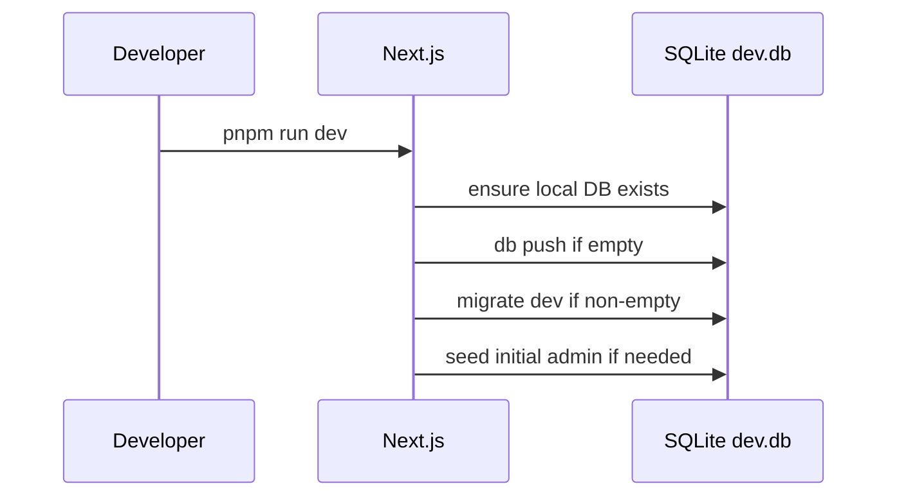
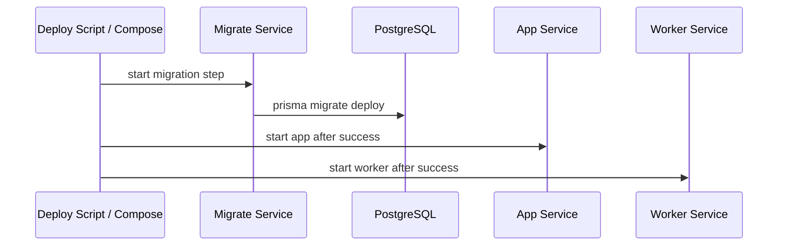

# Runtime And Ops

## Environment Model

### Local Development

- `DATABASE_URL="file:./dev.db"`
- app runs with SQLite
- `pnpm run dev` prepares the local database before startup
- Prisma uses the SQLite schema by default

### Docker / Production-Style Deployment

- Docker Compose runs PostgreSQL, migrations, app, and worker
- app, worker, and migration flows use explicit runtime-specific Postgres URLs:
  - `APP_DATABASE_URL`
  - `WORKER_DATABASE_URL`
  - `MIGRATION_DATABASE_URL`
- each service maps its runtime-specific URL into `DATABASE_URL` for Prisma or compatibility paths
- Prisma migrations run through `prisma.config.postgres.ts`
- local development can continue using `DATABASE_URL="file:./dev.db"` without defining every runtime-specific URL

## Database Behavior

## Validation Model

- `.\validate.ps1 all`
  - typecheck
  - lint
  - duplication
  - semgrep
  - UTF-8 validation
  - dependency cooldown support validation
  - unit tests
- `.\validate.ps1 full`
  - heavier validation, including Playwright
- `.\validate.ps1 continuity`
  - checks whether `CONTINUE.md` / `CONTINUE_LOG.md` need refresh
- `.\validate.ps1 commit`
  - validates
  - refreshes continuity
  - stages continuity files
  - then commits

## Dependency Safety Policy

### pnpm

- repo-local policy file: `.npmrc`
- required setting:
  - `min-release-age=7`
- validation fails if the local pnpm binary does not honor `min-release-age`

### uv

- repo-local worker policy in `worker/pyproject.toml`
- required setting:
  - `[tool.uv]`
  - `exclude-newer = "1 week"`
- validation fails if the local `uv` binary does not support `--exclude-newer`

### Trivy

- repo-local audit script: `scripts/supply-chain-audit.ps1`
- default scanner image is pinned by digest
- scanner image release timestamp must be at least 7 days old
- runtime image scans use `--ignore-unfixed` so the gate blocks fixable
  High/Critical CVEs and avoids permanent failure on distro findings without an
  upstream fix
- custom scanner images require both:
  - `WEBAPP_TEMPLATE_TRIVY_IMAGE`
  - `WEBAPP_TEMPLATE_TRIVY_IMAGE_RELEASED_AT`
- emergency cooldown bypass requires explicit `-AllowTrivyCooldownOverride` or
  `WEBAPP_TEMPLATE_ALLOW_TRIVY_COOLDOWN_OVERRIDE=1`

## Background Jobs Runtime

- jobs are created via the Next.js API
- jobs are stored in the shared database
- the worker claims pending jobs from the same database
- the admin dashboard displays recent jobs and status

## Baseline Operational Rules

- keep local dev simple
- keep Docker/prod behavior explicit and separated by runtime responsibility
- prefer one shared source of truth in the database
- keep validation deterministic
- fail clearly when required tooling or policy support is missing
- do not give the app runtime migration-only or worker-only credentials without a documented exception
