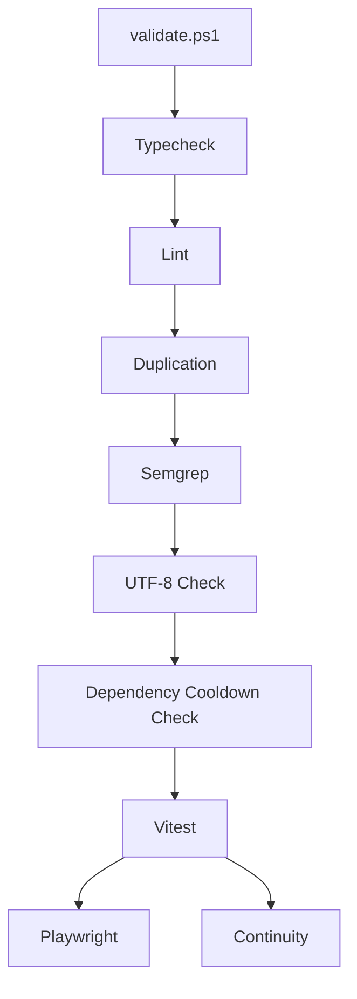

# Testing And Quality

## Purpose

This document summarizes how quality is enforced across the starter.

## Testing Layers

### Unit Tests

Tooling:

- Vitest

Coverage focus:

- auth helpers
- RBAC rules
- route authorization
- audit logic
- health logic
- background jobs route
- background jobs dashboard page

### End-To-End Tests

Tooling:

- Playwright

Coverage focus:

- local login
- logout
- SSO login behavior
- revoked access handling
- theme persistence
- user management flow
- RBAC enforcement
- background jobs admin dashboard

### Python Worker Tests

Tooling:

- Python `unittest`

Coverage focus:

- worker job processing
- SQLite claim / complete / fail transitions

## Validation Pipeline

## Validation Modes

### `all`

Fast default validation:

- typecheck
- lint
- duplication
- semgrep
- UTF-8 validation
- dependency cooldown support validation
- unit tests

### `full`

Heavier validation:

- everything in `all`
- Playwright E2E tests
- production dependency audit

### `continuity`

- checks whether `CONTINUE.md` / `CONTINUE_LOG.md` require refresh

### `commit`

- runs validation
- refreshes and stages continuity files
- then performs commit flow

## Dependency Safety Gates

### npm

- must support `--min-release-age`
- repo config requires `min-release-age=7`

### uv

- must support `--exclude-newer`
- worker config requires `exclude-newer = "1 week"`

## Quality Expectations

- no failing typecheck
- no failing lint
- no blocking semgrep findings
- no invalid UTF-8 in tracked/untracked text candidates
- no unsupported dependency-tooling environment

## Residual Risks

Even when the baseline validation passes, the following still deserve conscious attention:

- Docker runtime behavior
- production PostgreSQL migration behavior
- worker concurrency semantics under real load
- product-specific behavior added in derived repos
